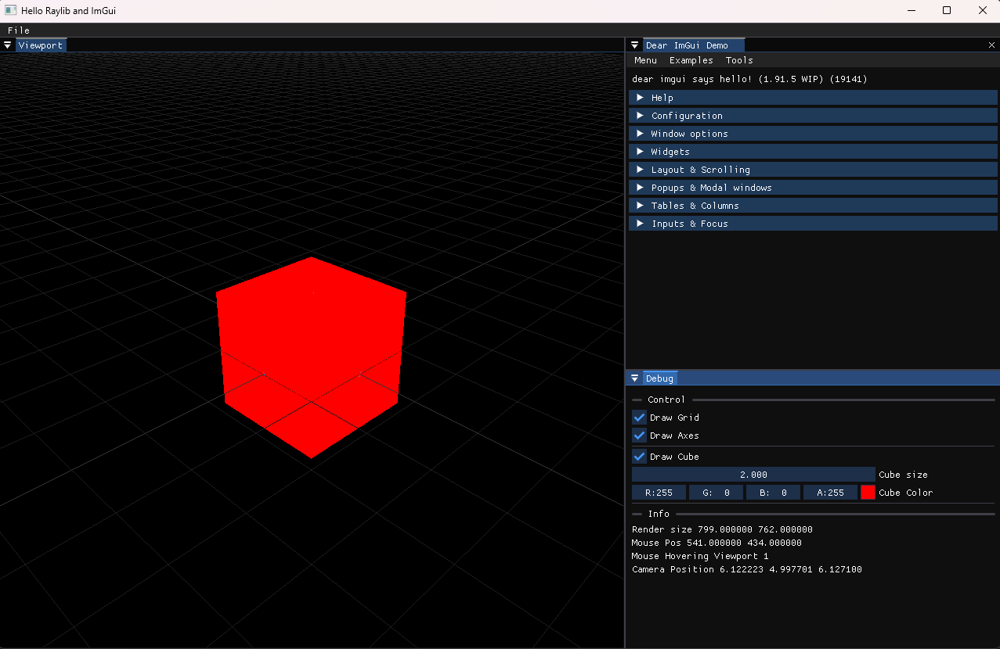

# Raylib-ImGui template
A simple cross platform C++ template for using ImGui with Raylib.
It integrate [ImGui](https://github.com/ocornut/imgui/tree/docking) (the docking branch), using the [rlImGui](https://github.com/raylib-extras/rlImGui) backend, and [ImPlot](https://github.com/epezent/implot) With [Raylib](https://github.com/raysan5/raylib) for rapid prototyping.


It uses [premake5](https://premake.github.io/) for the build system.
## Supported Platforms
* Windows 
* Linux

# Build
- Make sure you have the needed software to use [raylib](https://github.com/raysan5/raylib)
- For linux you may need to install the needed dependancies
  - On Ubuntu : 
``` bash
sudo apt install libasound2-dev libx11-dev libxrandr-dev libxi-dev libgl1-mesa-dev libglu1-mesa-dev libxcursor-dev libxinerama-dev libwayland-dev libxkbcommon-dev
```
- Please consult the raylib [Wiki](https://github.com/raysan5/raylib/wiki) for more details on your specefic platform
## Windows : Visual Studio 2022
- Generate the solution using `generate_solution.bat` which will generate the Visual Studio 2022 solution files (.sln) using premake
## Linux : GNU Make
* cd into the `build` folder
* run `./premake5 gmake2` to generate the `MakeFile` (in the root directory)
* cd back to the root
* run `make`

## Dependencies
The dependecies are automatically downloaded in the `build/external` directory (the latest version is downloaded)

Currently we depend on :
- [raylib](https://github.com/raysan5/raylib)
- [ImGui](https://github.com/ocornut/imgui/tree/docking)
- [rlImGui](https://github.com/raylib-extras/rlImGui)
- [ImPlot](https://github.com/epezent/implot)

In order to update the dependencies, just delete the `build/external` and the latest releases will be automatically donwloaded when generating the solution files (for example you need to run `generate_solution.bat` in Windows). For more info check the functions `check_raylib` and `check_imgui` in the [premake](build/premake5.lua) file.

# Note
- This template has been greatly inspired by [raylib-quickstart](https://github.com/raylib-extras/raylib-quickstart)
